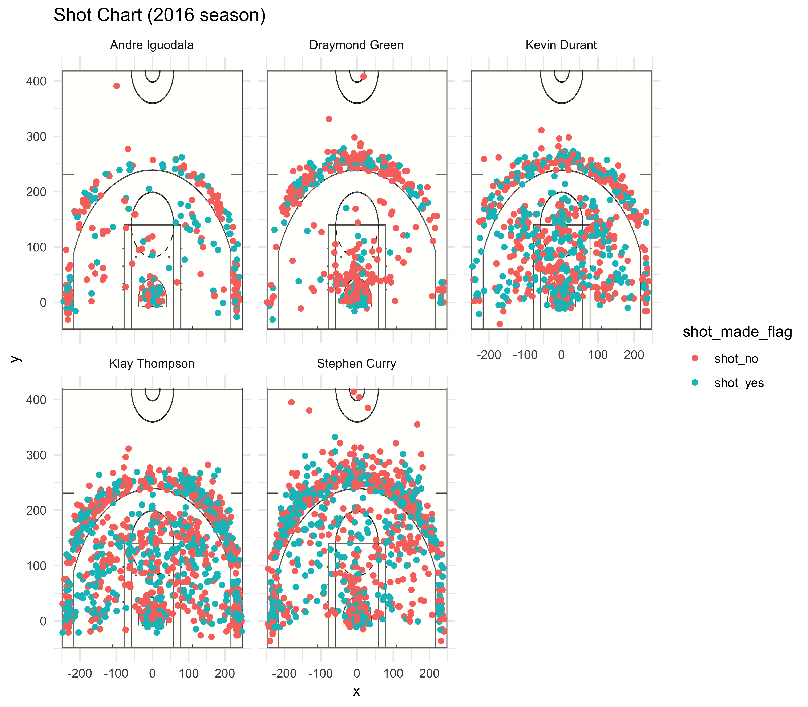

```{r setup, include=FALSE}
knitr::opts_chunk$set(echo = TRUE)
library(dplyr)
shots <- read.csv("./../data/shots-data.csv", stringsAsFactors=FALSE)
```


## Effective Shooting Percentage

```{r include=TRUE}
summarise(group_by(shots, name), total=sum(shot_type=="2PT Field Goal"), made =sum(shot_type=="2PT Field Goal" & shot_made_flag=="shot_yes")) %>% mutate(perc_made=made/total) %>% arrange(desc(perc_made))

summarise(group_by(shots, name), total=sum(shot_type=="3PT Field Goal"), made =sum(shot_type=="3PT Field Goal" & shot_made_flag=="shot_yes")) %>% mutate(perc_made=made/total) %>% arrange(desc(perc_made))

summarise(group_by(shots, name), total=sum(shot_type!=""), made =sum(shot_made_flag=="shot_yes")) %>% mutate(perc_made=made/total) %>% arrange(desc(perc_made))
```

## Narrative
```{r out.width='80%', echo = FALSE, fig.align='center'}

```
Given the numerous years of success with the Golden States Warriors, an examination into their shooting statistics reveal interesting insights into the habits and successes of key players. From analyzing five players, Andre Iguodala, Dramond Green, Kevin Durant, Klay Thompson, Stephen Curry, and their shooting numbers from the 2016 season, it becomes clear that their high shooting percentages are crucial in making them one of the most successful teams in the league as each player has strengths and weaknesses that are balanced out by their teammates. 
```{r out.width='80%', echo = FALSE, fig.align='center'}
knitr::include_graphics('./../images/stephen-curry-shot-chart.pdf')
```
Out of the five players listed, Stephen Curry takes the most risks in finding a positional advantage and taking a shot at the basket. In the 2016 season, he was not only the player who took the most chances at a 3-Point Field Goal, but proportionally chose to shoot a 3-Pointer over a 2-Pointer more compared to his teammates. This is also evident looking at his shot chart as out of all the players, his shots did seem to be more clustered around the 3-point line rather than under the hoop compared to the others. Despite his 41% success rate with these risky shots (second overall on his team when looking at 3-Point success rates), his play style did leave him lower on the overall shot percentage leaderboard as he comes in fourth. However, this should not detract from his importance on the team. At 1,250 shots attempted over the 2016 season, he leads the board in shots attempted and shots made out of all the others examined here.

```{r out.width='80%', echo = FALSE, fig.align='center'}
knitr::include_graphics('./../images/andre-iguodala-shot-chart.pdf')
```
Andre Iguodala presents an interesting case as he took many less shots than the rest of his teammates on the leaderboard: 371 total shots over the 2016 season compared to Kevin Durant's 915 shots. However, the shots he did take prove to be quite accurate as out of the five players, Iguodala has the second-highest percentage of shots made. From the table above, it becomes clear that Iguodala's strength lies below the basket rather than from the 3-point line as he leads the percentage of shots made when it comes to 2-Point Field Goals - making up for his more average performance with 3-point shots.

```{r out.width='80%', echo = FALSE, fig.align='center'}
knitr::include_graphics('./../images/kevin-durant-shot-chart.pdf')
```
Another star player, Kevin Durant leads the team in percentage of shots made. Doing well in both 2-point and 3-point shots, he seems to be a well-rounded player that plays a crucial part in his team's success. His distribution of shots ranges all across the area under the basket and the 3-point line. Indeed, his overall percentage of shots made at 54% comes in at almost five percent higher than the Warrior's team average in 2016 which was 49.4%. However, an argument can be made that Durant's strength lies beneath the basket as he leads the team in 2PT shot percentage accuracy. While examining his shot chart, his successful shots are more strongly clustered within the 3-point line than outside it.

```{r out.width='80%', echo = FALSE, fig.align='center'}
knitr::include_graphics('./../images/klay-thompson-shot-chart.pdf')
```

Like Stephen Curry, Klay Thompson helped lead the team in pure numbers of shots attempted and shots made. The similarities between Curry and Thompson do not stop there, however. Thompson also excels in 3-point shots as he leads the team percentage of 3-point shots made at 42.4% (and for reference, Curry himself is at 40.8%) - although Curry does hold the edge in 2-point shots made (54% accuracy compared to Thompson's 51.4% accuracy). As shown from the above graphic, Thompson does seemed to be slightly more inclined to spread out around the court when taking his shots as Curry demonstrates an inclination to shoot either from behind the 3-point line or right under the basket. However, when played with the other potent players of the Warriors, there is no doubt Thompson poses an indispensable offensive threat.

```{r out.width='80%', echo = FALSE, fig.align='center'}
knitr::include_graphics('./../images/draymond-green-shot-chart.pdf')
```
Not to be ignored, Draymond Green is the last player examined. Although he trails behind all the other players mentioned in terms of stats, his statistics reveal interesting quirks about his playstyle. Even moreso than other players, Green prefers to choose either the 3-point line or right under the basket to take his shot. Markers of his position when he takes a shot are heavily clustered either around the 3-point line or basket, although his preference to take a shot from the 3-point line seems typical compared to other players on his team. He also seems to be the one on the team who doesn't mind taking risks (along with Curry) as he does seem to show more outliers than most of his team when it comes to taking a shot from almost near the half-court line.

Due to the great offensive threats the players of the Warriors pose, the Warriors have been able to go through a highly successful 2016 season. The shot charts of the players demonstrate that the Warriors have dangerous players both at the 3-point line and underneath the basket that make it difficult for any team to go head to head with them in their home side of the court. Players specializing in long-distance shots like Curry, combined with players most successful under the basket like Durant, and all-around players like Thompson help make Warriors the well-rounded, recorded breaking team it needs to go to the NBA league finals.
